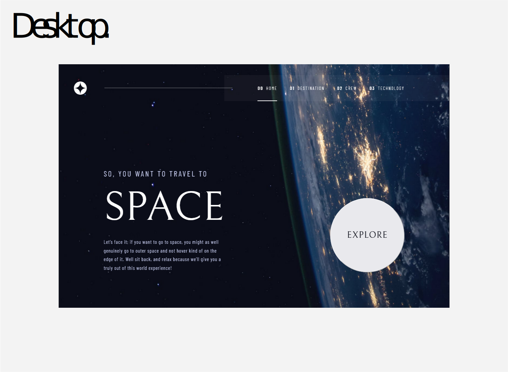
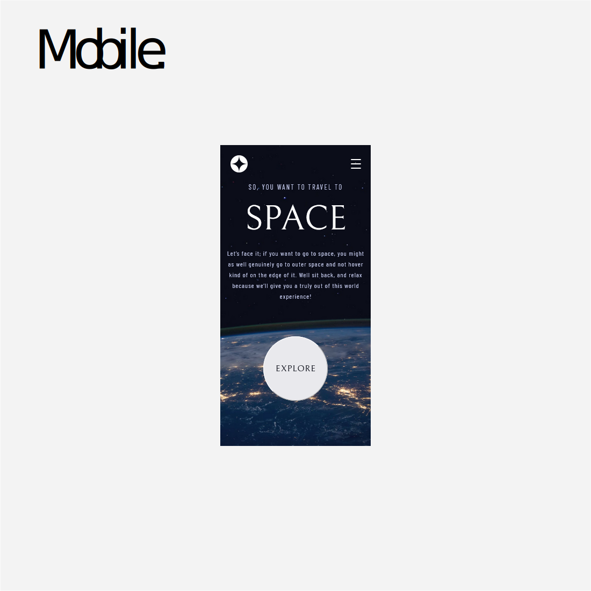

# Space tourism website solution

This is a solution to the [Space tourism website challenge on Frontend Mentor](https://www.frontendmentor.io/challenges/space-tourism-multipage-website-gRWj1URZ3).

## Table of contents

- [Overview](#overview)
  - [The challenge](#the-challenge)
  - [Screenshot](#screenshot)
  - [Links](#links)
- [My process](#my-process)
  - [Built with](#built-with)
  - [Continued development](#continued-development)
  - [Useful resources](#useful-resources)
- [Author](#author)
- [Acknowledgments](#acknowledgments)

## Overview

### The challenge

Users should be able to:

- View the optimal layout for each of the website's pages depending on their device's screen size
- See hover states for all interactive elements on the page
- View each page and be able to toggle between the tabs to see new information

### Screenshot

### Links

- Solution URL: [https://github.com/hugodelbegue/space-tourism-website-main](https://github.com/hugodelbegue/space-tourism-website-main)
- Live Site URL: [https://hugodelbegue.github.io/space-tourism-website-main](https://hugodelbegue.github.io/space-tourism-website-main)

## My process

### Built with

- Semantic HTML5 markup
- CSS custom properties
- Flexbox
- CSS media querie
- Responsive
- Vue event management
- Mobile-first workflow
- [Google Fonts](https://fonts.google.com/) - Fonts imports for typography
- [Sass](https://sass-lang.com/) - CSS language preprocessor
- [Vue.js](https://vuejs.org/) - Vue framework

### Continued development

I will continue to practice the routing, and the different measures in responsive.

### Useful resources

- [Google](https://www.google.com/) - Google search engine.
- [W3 Schools](https://www.w3schools.com/) - Library of Html, CSS and Javascript resources.
- [Developer mozilla](https://developer.mozilla.org/fr/) - Resources for Html CSS and Javascript. Here you will find all the necessary documentation for the methods to be used.
- [Vue.js Documentation](https://vuejs.org/guide/introduction.html) - This is an amazing article which helped me finally understand XYZ. I'd recommend it to anyone still learning this concept.

## Author

- Website - [primalprod.fr](https://primalprod.fr/)
- Frontend Mentor - [@hugodelbegue](https://www.frontendmentor.io/profile/HUGODELBEGUE)
- GitHub - [hugodelbegue](https://github.com/hugodelbegue)

## Acknowledgments

Youtube tutorials:

- Youtube [https://www.youtube.com//](https://www.youtube.com/)

Online training:

- Codecademy [https://www.codecademy.com/](https://www.codecademy.com/)
